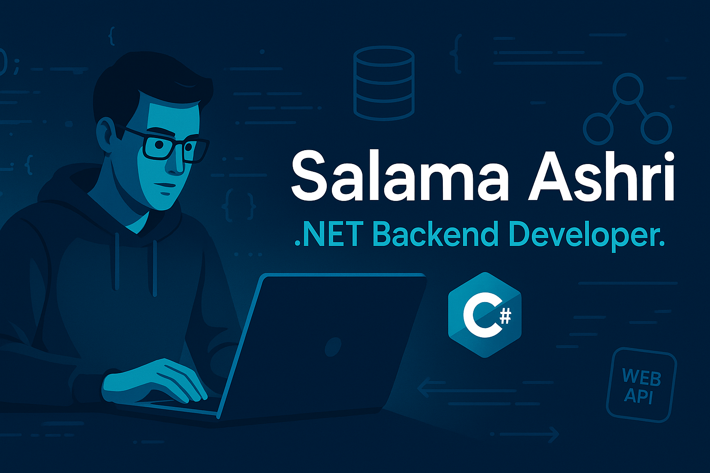

# SA.Portfolio.io

Welcome to my personal portfolio website — a showcase of my work as a professional .NET Backend Developer. Built with clean architecture principles, modular design, and a focus on scalability and maintainability.

🚀 **Live Website**: [Visit SA.Portfolio.io](https://salamaashri.github.io/SA.Portfolio.io/)

## 🧠 About Me

I specialize in building robust backend systems using:

- **C#**, **ASP.NET MVC**, **Web API**
- **SQL Server**, **Entity Framework Core**, **LINQ**
- **Clean Architecture**, **Dependency Injection**, **Repository & UnitOfWork Patterns**
- **JWT Authentication**, **SignalR**, **Real-time Communication**
- **Modular Design**, **Reusable Components**, **Database Optimization**

I'm passionate about technical excellence, clean code, and crafting systems that are both powerful and elegant.

## 📸 Preview

## 📬 Contact

Feel free to reach out via the contact section on the website or connect with me on [LinkedIn](https://www.linkedin.com/in/salamaashri).

---

> This portfolio is continuously evolving — stay tuned for new projects, features, and backend innovations.